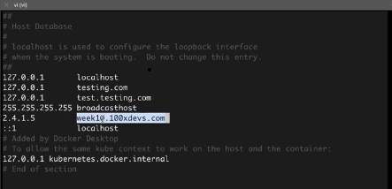
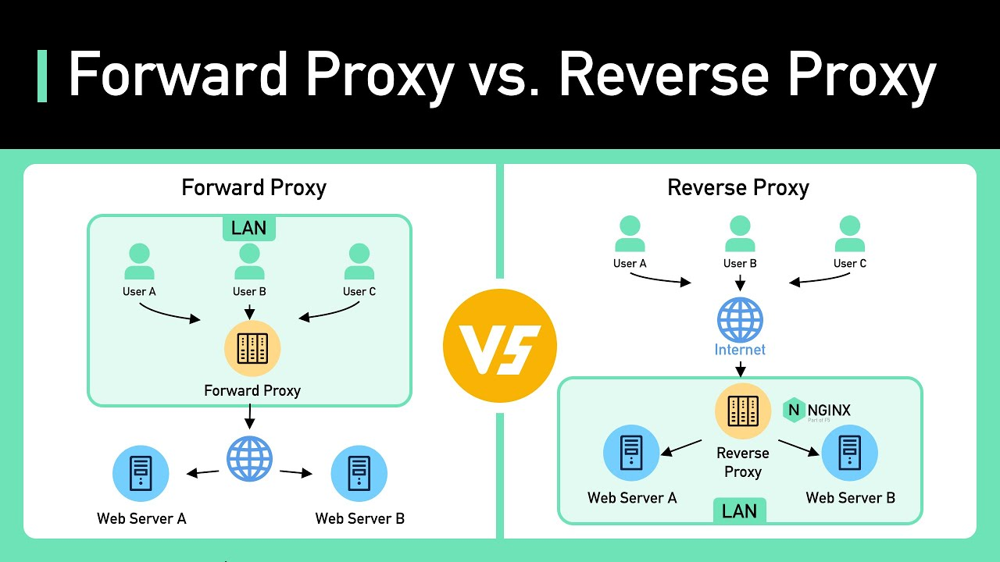
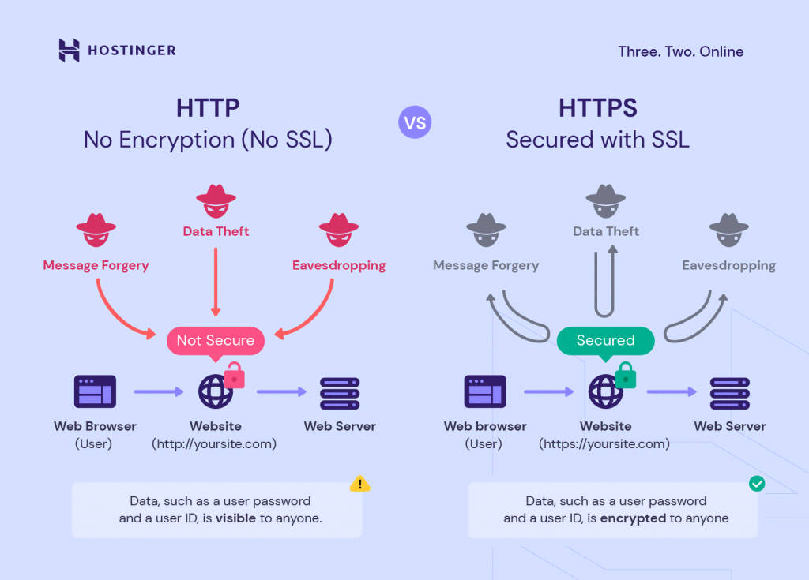
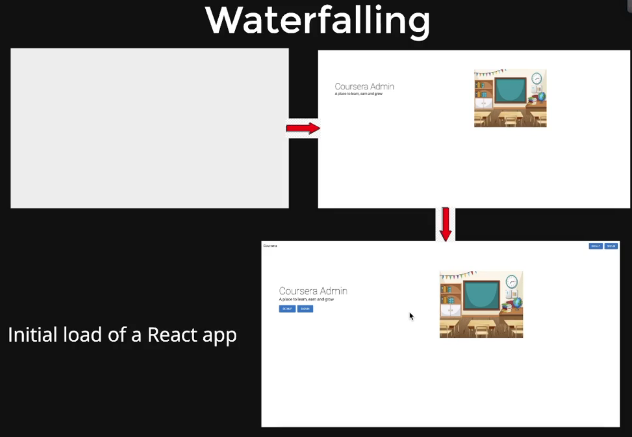

<h1 style="color:yellow"><center>Frontend Deployments, Certificate Management & Next.js 🧾</center></h1>

## Table Of Contents

- []()

**[⬆ Back to Top](#table-of-contents)**

- Certificate management (and GH action to redeploy)
- Frontend deployments
- nginx as reverse proxy

- Pointing your domain to the server
  - Setup the DNS (Domain Name Service)
  - Now when we add the domain name to our server we still have a problem like http://www.rudrabehera.com:3000 here the server is running on port 3000 we want it to run on port 80 for http and port 443 for https
  - So that it will work like domainName.com/

## Nginx as Reverse Proxy


Sure, let's understand the concept of a reverse proxy with examples of subdomains running on different ports and the same port.

Scenario 1: Subdomains Running on Different Ports

Suppose you have a web server that serves multiple applications on different ports, and you want to make these applications accessible via subdomains. A reverse proxy can help achieve this. Here's an example:

You have two applications running on your server:

App1: Running on port 8000
App2: Running on port 8080
You own the domain example.com, and you want to make these applications accessible via subdomains:

app1.example.com should point to App1.
app2.example.com should point to App2.
You can use a reverse proxy like Nginx to configure this:

```nginx
server {
listen 80;
server_name app1.example.com;

    location / {
        proxy_pass http://localhost:8000;
    }

}

server {
listen 80;
server_name app2.example.com;

    location / {
        proxy_pass http://localhost:8080;
    }

}
```

In this configuration, Nginx listens for incoming requests on port 80, and based on the server_name (subdomain), it forwards the request to the appropriate application running on different ports.

Scenario 2: Subdomains Running on the Same Port

Let's consider a scenario where you have multiple web applications running on the same port, and you want to differentiate them based on subdomains. Here's an example:

You have one web server running on port 80.
You have two applications: App1 and App2.
You want to access these applications via subdomains:
app1.example.com should point to App1.
app2.example.com should point to App2.
You can configure Nginx as a reverse proxy to achieve this:

```nginx
server {
listen 80;
server_name app1.example.com;

    location / {
        proxy_pass http://localhost:80;
        proxy_set_header Host $host;
    }

}

server {
listen 80;
server_name app2.example.com;

    location / {
        proxy_pass http://localhost:80;
        proxy_set_header Host $host;
    }

}
```

In this case, both subdomains point to the same server and port. Nginx distinguishes the applications based on the server_name (subdomain) and forwards the requests accordingly.

With reverse proxies, you can efficiently route traffic to different backend applications running on various ports or the same port, allowing you to use subdomains to differentiate them and simplify access control and management.

- Our nginx code is present in repo-9 week 9 part-1-nginx

- first install nginx on the server `sudo apt-get install nginx` and it runs on port 80
- now copy the whole conf file to `sudo vi /etc/nginx/nginx.conf` now when you open the file its already filled with information.
- Then delete the file conf with `sudo rm /etc/nginx/nginx.conf` and then recreate it using `sudo vi /etc/nginx/nginx.conf` and copy the contents change the server name
- next step `sudo nginx -s reload`

HACK: -> IF you dont have your domain name still you can point out your ip like week-10.100xdev.com or google.com. But it will only show you in your local machine only.

- For that open the file `vi /etc/hosts`
- here you can a url can resolve to. Now add ec2 server ip domain name along with that.
  

- This is just like a phising website

- Difference between forward proxy and reverse proxy

  > Forward Proxy:
  > Acts on behalf of clients.
  > Used to access the internet and provide client anonymity.
  > Commonly used for web filtering, privacy, and bypassing restrictions.
  > Reverse Proxy:
  > Acts on behalf of servers.
  > Used to enhance server performance, security, and load balancing.
  > Commonly used for load balancing, security, caching, and content optimization.

  

### Certificates



Not having a secure connection in a web browser can lead to several problems and risks, including:

1. Data Interception: Without secure connections (e.g., HTTPS), data transmitted between your browser and a website can be intercepted and viewed by malicious actors, potentially exposing sensitive information like login credentials and personal data.

2. Man-in-the-Middle Attacks: Attackers can insert themselves between your browser and the website you're visiting, allowing them to monitor and manipulate the data being exchanged. This is known as a Man-in-the-Middle (MitM) attack.

3. Data Tampering: Insecure connections are susceptible to data tampering, where attackers can modify the content of web pages or inject malicious scripts, leading to potential security vulnerabilities or the spread of malware.

4. Privacy Concerns: Lack of encryption can compromise your privacy. Without a secure connection, your browsing activity may be monitored and tracked by various entities, including advertisers.

5. Phishing Risks: Phishing websites often use insecure connections to impersonate legitimate sites. Users may be more likely to fall victim to phishing attacks when not on secure websites.

- How to get?

  - CA authorities (Godaddy)
  - Free Certs (certbot)

- Go to certbot.eff.org and select the things where you server is running and perform the necessary operations. It will then make some changes in the conf file.
- You have to write some github action for it to run every 3 months as it is only valid for 3 months and we have to recreate it.

### Deploying frontend

- Easiest : run npm run dev on the ec2 server
- Easy : Free CDNs (Vercel/Netlify)
- Mid : S3/ your own CDN
- Hard : ec2 instances? (Does this fix cors?)

#### Deployment

`npm run build` creates a build directory with a production build of your app. Set up your favorite HTTP server so that a visitor to your site is served index.html, and requests to static paths like /static/js/main.<hash>.js are served with the contents of the /static/js/main.<hash>.js file. For more information see the production build section.

- Static Server
  For environments using Node, the easiest way to handle this would be to install serve and let it handle the rest:

```sh
npm install -g serve
serve -s build
```

The last command shown above will serve your static site on the port 3000. Like many of serve’s internal settings, the port can be adjusted using the -l or --listen flags:

```sh
serve -s build -l 4000
```

Run this command to get a full list of the options available:

```sh
serve -h
```

Run on port 5173 like

```sh
serve -p 5173
```

100xDev Steps:

1. Add this code to the server index.js

```js
app.use(express.static("public"));
app.get("/*", function (req, res) {
  res.sendFile(path.join(__dirname, "/public/index.html"));
});
```

This code goes into the frontend if the req url routes is not present in the backend.

2. Go to the ec2 instance then clone the repo

Then cd to each client and server npm install

```sh
npm i

#  in the server run
npm run start

#  OR run using pm2

pm2 start npm -- start
```

The script start has this in it

```sh
cd ../admin-client && npm run build && rm -rf ../server/public && mkdir -p ../server/public && mv ./dist/* ../server/public && cd ../server && node index.js
```

Here, when this script runs it goes to client then runs some script then takes the dist folder which contains all the react logic in the form of html,css and js to the public folder in the server. And then it runs the server.

Now, we can also add cors for frontend security. But even if we remove it we do not get any cors error as the frontend and backend are running on the same port.

This can be good approach for this type of frontends not for Next.js with server side rendering.

### Next.js

- React is a subset of next.js

- Problems with react, why even SSR?

  - Waterfalling
  - not seo optimised
  - Doesn't work in places JS cant run (emails)

  Solution

  - Server Side Rendering

> Note:- The term "waterfalling" in the context of React typically refers to a pattern or practice where data is passed down from parent components to child components in a hierarchical and one-way manner. This pattern is often used in React applications to manage the flow of data and props from higher-level components to lower-level components, ensuring a predictable and unidirectional data flow.



here in the image we can see that react loads a component after it gets the response so that first we see a white blank screen then one component then another component. But it happens so fast that we cannot we see the white blank screen. This is still unoptimal.

- Server Side Rendering

  > - The process of doing initial render on the server.

  - All following rendering because of state updates happen on client
  - Can use other server components, divs and spans
  - Can import libraries only on the server to keep small bundle size
  - Have complete access to backend
  - Can read from a file

  * SSR stands for "Server-Side Rendering." It's a technique used in web development to render web pages on the server and send fully rendered HTML pages to the client's browser. This is in contrast to traditional client-side rendering, where the browser downloads JavaScript code that then renders the page.

    - Key points about Server-Side Rendering (SSR) include:

    1. Rendering on the Server: With SSR, the initial rendering of the web page is performed on the server. This means that the server generates the HTML content of the page, including the data from a database or other sources.

    2. Faster Initial Page Load: SSR typically leads to faster initial page loads because the browser receives pre-rendered HTML, reducing the time needed for the page to become interactive. Users can see and interact with the content sooner.

    3. Improved SEO: Search engines can more easily index and understand content when it's available in the initial HTML response. SSR is often used to enhance search engine optimization (SEO).

    4. Optimal for Content-Heavy Sites: SSR is well-suited for content-heavy websites and applications where SEO and fast initial page loads are important.

    5. Server Load: Server-Side Rendering can put additional load on the server because it has to generate the HTML for each request. This is why it's often used in conjunction with server-side technologies and frameworks that can handle this load efficiently.

    6. Hydration: After the initial HTML page is loaded in the browser, client-side JavaScript can take over to make the web page interactive. This process is often called "hydration."

    - React, for example, supports Server-Side Rendering through libraries like Next.js, which allow you to build web applications that can be rendered on the server and then further processed on the client. This approach can combine the benefits of SSR and client-side rendering, providing a good user experience and search engine optimization.

    - In summary, Server-Side Rendering (SSR) is a technique in web development that involves rendering web pages on the server and sending pre-rendered HTML to the client, often resulting in faster page loads, improved SEO, and a better user experience.

- Facts about Next.js/SSR

  1. No access to browser constructs (localStorage, window)
  2. Can't run hooks, doesn't understand state
  3. Only renders once(the first time) on the server, future rendering(based on state change) happens on the browser
  4. Also lets you write HTTP backend routes(no need for express)

- Moving course selling app to nextjs

  - First clone week 10.2 repo
  - Fixes Faster loads/SEO optimisations
  - Doesn't fix waterfalling
  - How to fix waterfalling?
  - Auth is even harder to fix w/o cookies

> NOTE: Certainly, let's break down the benefits of Next.js compared to React for handling dynamic content like courses on a webpage:

> React:

> In a typical React application, when you navigate to a page with dynamic data (e.g., /courses), the page loads quickly, but the data is initially empty or loading.
> The data is fetched from the server via an API request after the initial page load, which means there's a delay before you can see the content.
> This approach can result in a "flash" of empty or loading content on the page, which may not provide the best user experience.

> Next.js:

> Next.js is a framework built on top of React that introduces Server-Side Rendering (SSR) and static site generation (SSG) capabilities.
> When you navigate to a page with dynamic data (e.g., /courses) in a Next.js application, the page is pre-rendered on the server before it's sent to the client's browser.
> The data is fetched during the server-side rendering process using functions like getServerSideProps or getStaticProps. This means the page is already populated with data when it loads in the browser.
> Users don't experience the "flash" of empty content, and the content is available immediately, resulting in a faster and smoother user experience.
