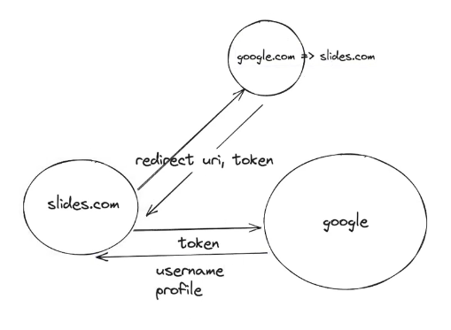

<h1 style="color:yellow">
Building an end to end mono repo  🧾
</h1>

## Table Of Contents

- 

**[⬆ Back to Top](#table-of-contents)**

### Mono Repo

> _A monorepo (short for "monolithic repository") is a software development and version control strategy where multiple projects or components of a software system are stored in a single, centralized repository. In a monorepo, all related code, libraries, and dependencies are managed together in a single version control system (e.g., Git)._ This is in contrast to a multi-repository approach where each project or component has its own separate repository.

Key characteristics and benefits of a monorepo include:

1. Code Sharing: In a monorepo, code sharing is simplified because all components or projects are in one repository. This can promote code reuse and consistency across different parts of the system.

2. Easier Cross-Project Refactoring: When you make changes to one part of the codebase, you can easily update all dependent projects within the same repository. This simplifies cross-project refactoring and ensures that all projects are kept in sync.

3. Shared Tooling: You can share build, test, and deployment tooling across all projects in the monorepo, which can lead to a more consistent and efficient development process.

4. Dependency Management: Managing dependencies becomes more straightforward since all projects share the same set of dependencies. This can help prevent version conflicts and streamline updates.

5. Atomic Commits: Changes to multiple projects can be committed atomically, ensuring that all parts of the system are in a consistent state.

6. Single CI/CD Pipeline: Continuous integration and continuous deployment (CI/CD) pipelines can be centralized for the entire monorepo, making it easier to manage automated testing and deployments.

7. Simplified Versioning: Versioning of projects within a monorepo can be coordinated, making it easier to ensure compatibility and track changes.

8. Enhanced Collaboration: Developers can easily collaborate on different parts of the system in the same repository, leading to better communication and shared knowledge.

9. Performance: Monorepos can provide performance benefits by reducing the need to clone and manage multiple repositories on local development machines.

- Checkpoint a mono repo in next.js + ts
- Mono repo in Nextjs
- Marination
- Building an end to end mono repo in NextJS + TS

- Steps to follow

  - Init a turbo mono repo(npx create-turbo@latest )
  - add a nextjs app with the page route in TS
  - Update next.config.js to use ui as an internal package(transpilePackages) and update the dependencies as `"ui": "*"`
  - Export right set of commponents from ui (check the index.tsx file in ui and the index.tsx file in components)
  - Install mui(react dependency will complain) -- an opportunity for an open source contribution
  - Put a simple signup/signin component (npm i from top)
  - Start adding backend, create a new db module(internal?)package
    for this create a separate package db and add `"main": "src/index.ts",
"types": "src/index.ts",` in the package.json
  - Where should db.connect be? Cache it in a file of its own

  create a dir in src called lib and have a file

  - Connect frontend to backend(notice no cors?)
  - Introduce store as a new module, transpile it
  - Introduce components folder for appbar

### Auth using next-auth

- env var
- oauth
- next-auth
- Pure next app(not a mono repo, although can be extended to it)
- Creating a react+next+express monorepo
- Deploying such a mono repo

- What is oauth?
- How to oauth?
  1. Your website registers with Google, gets back credentials
  2. user comes to your website, you send them to google
  3. Google calls back a redirect url with a token
  4. You do a server to server call to google to get back an access token
  5. You use the access token gives you access to the users email/photo/name

- Issue with nodejs version

  - next-auth is very sensitive to node version v18.1.0 doesnt work

- Lets use next-auth to build google and simple auth

  1. First go to google api credentials and create a project then create credentials & select oAuth client ID and configure it
  2. While configuring give scopes whichever is required for the auth like email and profile
  3. In Authorized JS origins give the website url and also the same in Authorized redirect URIs for now but we will change this eventually for next-auth
  4. Copy the client id and secret in the .env file
  5. In the authorized redirect uris add another value `http://localhost:3000/api/auht/callback/google`

  here in the folder week 11-2 offline you can see go to file ssr for solving the waterfall issue
