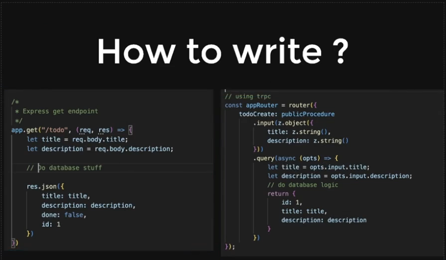

<h1 style="color:yellow"><center>tRPC and Advance SQL 🧾</center></h1>

## Table Of Contents

- []()

**[⬆ Back to Top](#table-of-contents)**

- tRPC

  > RPC is short for "Remote Procedure Call".

  - Moderate hard concept
  - will require marination
  - is not used everywhere, but is used in cal.com

- Why tRPC

  1. Automatic types on FE AND BE
  2. Generic code that can be converted to
     Express backend
     Nextjs backend
     ...

- Why TRPC for us?

  - cal.com uses it.
  - it'll be very hard to understand their be w/o trpc

- How does it do it?

  - Adapters

- What is RPC? What mindset should I adopt?
  - It's just functions
  - RPC is short for "Remote Procedure Call".
  - It is a way of calling functions on one computer (the server) from another computer (the client). With traditional HTTP/REST APIs, you call a URL and get a response. With RPC, you call a function and get a response.

```js
// HTTP/REST
const res = await fetch("/api/users/1");
const user = await res.json();

// RPC
const user = await api.users.getById({ id: 1 });
```

- Vocabulary
  - Below are some terms that are used frequently in the tRPC ecosystem. We'll be using these throughout the documentation, so it's good to get familiar with them. Most of these concepts also have their own pages in the documentation.

| Term         | Description                                                                                                  |
| ------------ | ------------------------------------------------------------------------------------------------------------ |
| Procedure    | API endpoint - can be a query, mutation, or subscription.                                                    |
| Query        | A procedure that gets some data.                                                                             |
| Mutation     | A procedure that creates, updates, or deletes some data.                                                     |
| Subscription | A procedure that creates a persistent connection and listens to changes.                                     |
| Router       | A collection of procedures (and/or other routers) under a shared namespace.                                  |
| Context      | Stuff that every procedure can access. Commonly used for things like session state and database connections. |
| Middleware   | A function that can run code before and after a procedure. Can modify context.                               |
| Validation   | "Does this input data contain the right stuff?"                                                              |



- LEt's create a basic TODO server and client

Backend - three step process

1. init trpc
2. Define your router
3. use the adapter to serve the api

- Output Validators

- Context and MIddlewares

  - Context

    > Your context holds data that all of your tRPC procedures will have access to, and is a great place to put things like database connections or authentication information.Setting up the context is done in 2 steps, defining the type during initialization and then creating the runtime context for each request.

    - Why would you put auth data and userid in context?
      Because it will be useful during accessing the auth data.

- Middlewares

> You are able to add middleware(s) to a procedure with the t.procedure.use() method. The middleware(s) will wrap the invocation of the procedure and must pass through its return value.
