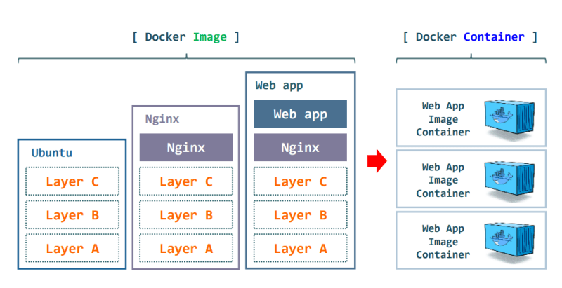

<h1 style="color:yellow"><center>Docker and Containerization 🧾</center></h1>

## Table Of Contents

- [Why are we learning it?](#why-are-we-learning-it)
- [Why Docker?](#why-docker)
  - [Properties of a container](#properties-of-a-container)
  - [What is Container?](#what-is-container)
  - [Images and containers](#images-and-containers)
    - [Key differences: Docker images vs. Docker containers](#key-differences-docker-images-vs-docker-containers)
- [Docker](#docker)
  - [Dockerhub](#dockerhub)
    - [What is the dockerfile?](#what-is-the-dockerfile)
    - [How to run?](#how-to-run)
    - [General Debate](#general-debate)
  - [Layers in docker](#layers-in-docker)
  - [Cached layers](#cached-layers)
  - [External libs](#external-libs)
- [Volumes in Docker Compose:](#volumes-in-docker-compose)
- [Networks in Docker Compose:](#networks-in-docker-compose)
- [Combining Volumes and Networks:](#combining-volumes-and-networks)
  - [Networks](#networks)
  - [How is app container able to access mongo?](#how-is-app-container-able-to-access-mongo)

**[⬆ Back to Top](#table-of-contents)**

## Why are we learning it?

- Practically why do you need it?

1. Local seyup of Project
2. Local setup of DBs/other services
3. Good to know how to deploy docker
4. Path to container orchestration
5. Automatic restarts (pm2?)
6. Much more lightweight than full machines, much easier to orchestrate

## Why Docker?

- Why do all projects have a 'dockerrized' way to setup the project locally.
- ANS:- Easy for developer(single command)
  Containrized code

### Properties of a container

- Containerization involves building self-sufficient software packages that perform consistently, regardless of the machines they run on.
- It's basically taking the snapshot of a machine, the filesystem and letting you use and deploy it as a construct.

### What is Container?

> Docker Container is a standardised unit which can be created on the fly to deploy a particular application or environment. It could be an Ubuntu container, CentOs container, etc. to full-fill the requirement from an operating system point of view.

### Images and containers

> Fundamentally, a container is nothing but a running process, with some added encapsulation features applied to it in order to keep it isolated from the host and from other containers. One of the most important aspects of container isolation is that each container interacts with its own, private filesystem; this filesystem is provided by a Docker image. An image includes everything needed to run an application — the code or binary, runtimes, dependencies, and any other filesystem objects required.


**[⬆ Back to Top](#table-of-contents)**

#### Key differences: Docker images vs. Docker containers

> - A Docker container is a self-contained, runnable software application or service. On the other hand, a Docker image is the template loaded onto the container to run it, like a set of instructions.

> - You store images for sharing and reuse, but you create and destroy containers over an application’s lifecycle. We give more differences next.

- Source

  You create a Docker image from a Dockerfile, a human-readable text file similar to a configuration file. The Dockerfile contains all the instructions to build the image. You have to place the Dockerfile along with all associated libraries and dependencies in a folder to build the image.

  In contrast, you create Docker containers directly from the Docker image file.

- Composition

  The Docker image file is composed of image layers to keep the file size small. Each layer represents a change made to the image. The layers are read-only and can be shared among multiple containers.

  The Docker container, being an image instance, also contains layers. However, it has an additional writable layer, known as the container layer, on top. The container layer allows read-write access. It also enables any changes made within the container to be isolated from other containers based on the same image.

- Mutability

  Docker images are immutable, which means they can’t be modified once created. If changes need to be made to an image, you must create a new image with the desired modifications.

  In contrast, containers are mutable and allow modifications during runtime. Changes made within a container are isolated to that particular container and don’t affect its associated image. Some examples of changes are when you write new files, install software, or modify configurations.


- In the above pic we can see that we build an docker image of the application using the docker build which is stored in the docker HUB then we run the container using docker run. As we can also see that we can create different container using the image and deplot it to different cloud services like ec2 and gcp.

> **Containers are images that are being run at the moment.**

**[⬆ Back to Top](#table-of-contents)**

## Docker

> Docker or Docker Engine, is a popular open-source container runtime that allows software devs to build, deploy, and test containerized applications on various platforms. Docker containers are self-contained packages of applications and related files that are created with the Docker framework.

    It has 3 parts
    1. Docker engine
    2. CLI
    3. Docker HUB

### Dockerhub

> Docker Hub is a repository service and it is a cloud-based service where people push their Docker Container Images and also pull the Docker Container Images from the Docker Hub anytime or anywhere via the internet.

- Container registry
- Similar to Github, but hosts images and not code
- Is there revenue generating arm
- https://hub.docker.com/_/mongo
- https://hub.docker.com/_/node

#### What is the dockerfile?

- Its a file that describes your image

1. You start from a base image(ubuntu/alpine/node)
2. Add all softwares to install
3. Copy over the files you want present in the container (your frontend and backend code)
4. build the project (npm install,npm run dev, npm run build...)
5. Expose the right sets of ports
6. Start your process

**[⬆ Back to Top](#table-of-contents)**

#### How to run?

1. Building the image
   `docker build -t <your_image_tag>`
2. Running the image
   `docker run <your_image_tag>`

e.g `docker run -p 3001:3000 express-app`

- Here is a list of commonly used Docker commands along with brief explanations and examples:

1. Build an image from a Dockerfile:

```sh
docker build -t image_name:tag .
```

-t assigns a tag to the image.
. specifies the build context (current directory in this case).

2. List all locally available images:

```sh
docker images
```

3. Run a container from an image:

```sh
docker run -d -p 8080:80 --name my_container image_name:tag
```

-d runs the container in the background.
-p maps host port 8080 to container port 80.
--name assigns a name to the container.

4. List running containers:

```sh
docker ps
```

- To see all containers (including stopped ones), use docker ps -a.

5. Stop a running container:

```sh
docker stop container_id
# OR
docker kill container_id
```

6. Start a stopped container:

```sh
docker start container_id
```

7. Remove a container:

```sh
docker rm container_id
```

- To remove a running container, add the -f option: docker rm -f container_id.

8. Remove an image:

```sh
docker rmi image_name:tag
```

- To force removal of an image in use, add the -f option: docker rmi -f image_name:tag.

9.  Inspect a container:

```sh
docker inspect container_id
```

10. View container logs:

```sh
docker logs container_id
```

- To follow logs in real-time, add the -f option: docker logs -f container_id.

11. Execute a command inside a running container:

```sh
docker exec -it container_id /bin/bash
```

- it provides an interactive terminal.

12. Copy files between the host and a container:

```sh
docker cp local_file.txt container_id:/path/in/container/
```

To copy from a container to the host, swap the arguments.

13. Pull an image from a registry:

```sh
docker pull image_name:tag
```

14. Push an image to a registry:

```sh
docker push image_name:tag
```

15. Tag an image:

```sh
docker tag image_name:source_tag image_name:target_tag
```

16. Clean up unused resources:

```sh
docker system prune
```

- This removes stopped containers, unused networks, and dangling images.

**[⬆ Back to Top](#table-of-contents)**

#### General Debate

- Notice the .dockerignore file
- Why not copy over node_modules to the image?
- Why do a fresh npm install there?
- Why build inside the docker image? Why not just copy over the dist folder?
  Ans: - 1. Env. specific binaries 2. Can run
  npm install --omit=dev
  to only have production dependencies 3. Layer optimisation

> Copying the entire node_modules folder into a Docker image is not recommended because it makes the image larger, impacts consistency, and can cause inefficiencies in the build process. It's better to copy only the package.json and package-lock.json files into the image, then run the npm install command within the Docker image to install dependencies. This approach is more efficient and ensures compatibility with the Docker image's base environment.

### Layers in docker

> Layers are the result of the way Docker images are built. Each step in a Dockerfile creates a new "layer" that's essentially a diff of the filesystem changes since the last step.




### Cached layers

- When you run a build, the builder attempts to reuse layers from earlier builds. If a layer of an image is unchanged, then the builder picks it up from the build cache. If a layer has changed since the last build, that layer, and all layers that follow, must be rebuilt.

- The Dockerfile from the previous section copies all project files to the container (COPY . .) and then downloads application dependencies in the following step (RUN go mod download). If you were to change any of the project files, then that would invalidate the cache for the COPY layer. It also invalidates the cache for all of the layers that follow.


- You can avoid this redundancy by reordering the instructions in the Dockerfile. Change the order of the instructions so that downloading and installing dependencies occur before the source code is copied over to the container. In that way, the builder can reuse the "dependencies" layer from the cache, even when you make changes to your source code.


**[⬆ Back to Top](#table-of-contents)**

### External libs

- How to use containers other people have created from dockerhub

```sh
docker run -d -p 27017:27017 mongo
```

- Deploying your own Image to dockerhub

- Combining internal and external images

- In the real world:-

  0. Docker is used for real world deployments
  1. env variables
  2. You have monorepos
  3. You have multiple applications(fe/be)
  4. docker-compose

0. Docker for Deployment

   - Create acc on dockerhub
   - login using docker cli
   - Push your image
   - Pull the image on an ec2 instance (make sure it has docker installed)
   - run the image

1. env variables

- Variables/values that influence the way an app behaves
- For developers, they offer a mechanism to store secrets, credentials, or general settings without hardcoding them into the source code.

2. How to use docker in a monorepo

   - lets checkout how backpack does it

3. What if you have multiple fe/be

- Frontends aren't usually dockerised
- Backends -> If monorepo, then same as last slide, if not then each folder has its own dockerfile

4. docker compose

- volumes and networks
  - Used for persisting data across the streets
  - Specifically used for things like database

In Docker Compose, volumes and networks are used to manage data persistence and network communication between containers in a multi-container application.

**[⬆ Back to Top](#table-of-contents)**

## Volumes in Docker Compose:

Volumes in Docker Compose provide a way to persist and share data between containers. They allow data to exist independently of the container lifecycle, making it easy to update or replace containers without losing important data.

Here's an example of using volumes in a `docker-compose.yml` file:

```yaml
version: "3"

services:
  web:
    image: nginx
    volumes:
      - ./html:/usr/share/nginx/html

volumes:
  mydata:
```

In this example:

- The `web` service uses the official Nginx image.
- The `volumes` section specifies a volume named `mydata` and maps the local `./html` directory to `/usr/share/nginx/html` in the container.

## Networks in Docker Compose:

Networks in Docker Compose allow containers to communicate with each other. By default, Docker Compose creates a default bridge network for your application, but you can also define custom networks for more control over communication.

Example with a custom network:

```yaml
version: "3"

services:
  web:
    image: nginx
    networks:
      - frontend
  db:
    image: postgres
    networks:
      - backend

networks:
  frontend:
  backend:
```

In this example:

- Two services (`web` and `db`) are defined, each connected to a different network (`frontend` and `backend`).
- The `networks` section specifies the custom networks `frontend` and `backend`.

**[⬆ Back to Top](#table-of-contents)**

## Combining Volumes and Networks:

You can use both volumes and networks together to create more complex setups. For instance, you might have a database container storing its data in a volume and a web application container communicating with it over a custom network.

```yaml
version: "3"

services:
  web:
    image: mywebapp
    networks:
      - frontend
  db:
    image: postgres
    networks:
      - frontend
    volumes:
      - db-data:/var/lib/postgresql/data

networks:
  frontend:

volumes:
  db-data:
```

In this example:

- Both `web` and `db` services are connected to the `frontend` network.
- The `db` service uses a volume named `db-data` to persist PostgreSQL data.

This combination allows the web application to communicate with the database while keeping the database data persistent across container restarts.

- Create volume in docker and attaching it to mongodb

```sh
docker volume create volume2

docker run -v volume2:/data/db -p 27017:27017 monog

```

**[⬆ Back to Top](#table-of-contents)**

### Networks

- networking is a fundamental part of Docker containers, allowing them to communiacate with each other and the outside world.

Lets explore
docker run -p 3000:80 nginx

```sh
docker network create my_custom_network
docker run --name webserver --network my_custom_network -d nginx
docker run --name testbox --network my_custom_network -it busybox sh ping webserver

```

### How is app container able to access mongo?

> For version 3 of the Docker Compose file format and Docker Compose will autommatically create a named bridge for your composition. This named bridge network allo;ws automatic service discovery using service names as DNS

- To run docker compose

```sh
docker compose up -d

docker compose down
```

**[⬆ Back to Top](#table-of-contents)**
