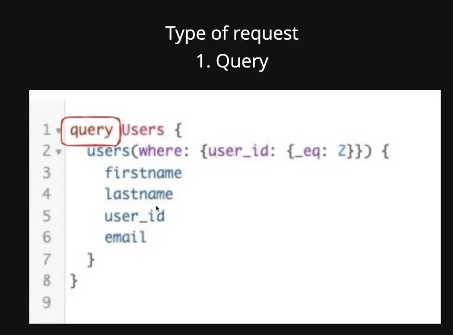
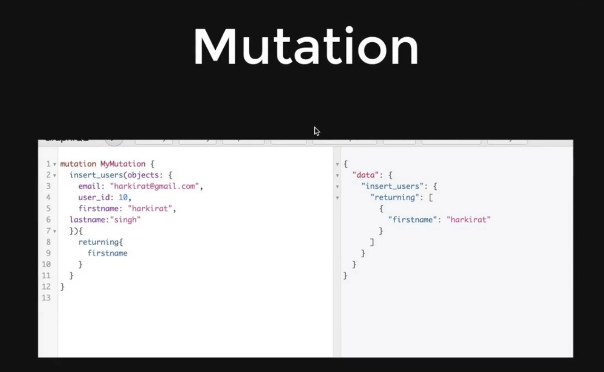
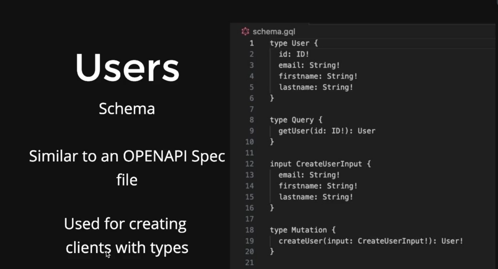
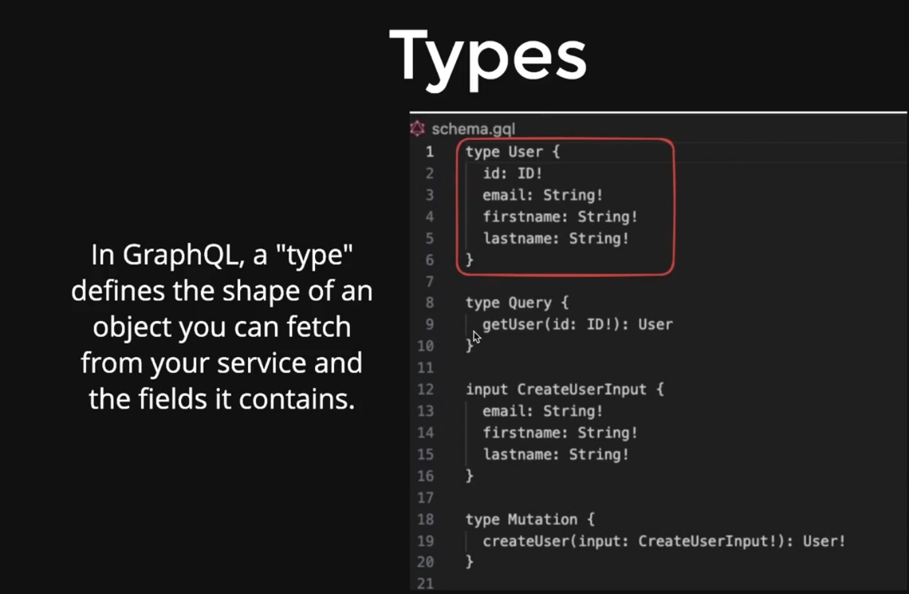
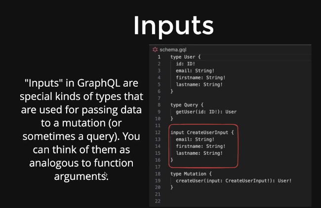

<h1 style="color:yellow"><center>GraphQL and Hasura 🧾</center></h1>

## Table Of Contents

- [WHY GraphQL?](#why-graphql)
  - [What is GraphQL](#what-is-graphql)
  - [Benefits over REST?](#benefits-over-rest)
  - [1. Fewer Requests:](#1-fewer-requests)
  - [2. Data Retrieval is Client-side Defined:](#2-data-retrieval-is-client-side-defined)
  - [3. Strongly Typed:](#3-strongly-typed)
- [How do define a graphql request](#how-do-define-a-graphql-request)
  - [1. Fields:](#1-fields)
  - [2. Arguments:](#2-arguments)
  - [3. Queries:](#3-queries)
  - [4. Mutations:](#4-mutations)
- [Type of request](#type-of-request)
- [Resolver Structure](#resolver-structure)
- [Resolver Functions](#resolver-functions)
- [Resolver Parameters](#resolver-parameters)
  - [Connecting Resolvers to a GraphQL Server](#connecting-resolvers-to-a-graphql-server)

**[⬆ Back to Top](#table-of-contents)**

## WHY GraphQL?

- Some projects use it
- Specifically backpack uses it as the ORM (What? is ORM? Is GraphQL and ORM???)

### What is GraphQL

- It is a query language
- Competitor to REST (HTTP protocol)

**[⬆ Back to Top](#table-of-contents)**

### Benefits over REST?

1. Fewer requests
2. Data retreival is client side defined
3. Strongly typed

- GraphQL offers several benefits over traditional REST APIs. Let's explore each of the mentioned benefits with code examples:

### 1. Fewer Requests:

With GraphQL, clients can request all the necessary data in a single query, reducing the need for multiple requests to different endpoints. This is known as "over-fetching" prevention. Clients can specify exactly what data they need, and the server responds with exactly that data.

**GraphQL Example:**

```graphql
// GraphQL Query
query {
  user(id: 123) {
    name
    email
    posts {
      title
      content
    }
  }
}
```

This query fetches user details (name and email) along with their posts (title and content) in a single request.

### 2. Data Retrieval is Client-side Defined:

GraphQL empowers clients to define the structure of the response. Clients can request only the fields they need, avoiding the download of unnecessary data. This flexibility is particularly beneficial for mobile or web clients where bandwidth is a concern.

**GraphQL Example:**

```graphql
// GraphQL Query
query {
  user(id: 123) {
    name
    email
  }
}
```

In this example, the client specifies that it only needs the `name` and `email` fields for the user.

### 3. Strongly Typed:

GraphQL APIs are strongly typed, meaning the server defines a schema that outlines the types and operations available. This provides clear documentation and ensures that clients receive the expected data types.

**GraphQL Schema:**

```graphql
type User {
  id: ID!
  name: String!
  email: String!
  posts: [Post]!
}

type Post {
  id: ID!
  title: String!
  content: String!
}

type Query {
  user(id: ID!): User
}
```

In this schema, the types (`User`, `Post`, etc.) and their fields are explicitly defined with their data types.

In contrast, let's consider how these benefits might look in a RESTful scenario:

**REST Example:**

```bash
# Multiple REST API requests
GET /users/123
GET /users/123/posts
```

With REST, multiple requests may be needed to fetch user details and their posts, leading to potential over-fetching of data.

**[⬆ Back to Top](#table-of-contents)**

## How do define a graphql request

1. **Fields**
2. **Arguments**
   ...bunch of other things
   through
3. **Queries**
4. **Mutations**

Certainly! In GraphQL, a request is defined by specifying the fields, arguments, and operation type (query or mutation). Let's break down these components with examples:

### 1. Fields:

Fields represent the data you want to retrieve from the GraphQL server. Fields are specified in a query or mutation, and the server responds with the requested data.

**Example:**

```graphql
# Query to retrieve user information
query {
  user {
    id
    name
    email
    posts {
      title
      content
    }
  }
}
```

In this example, the fields `id`, `name`, `email`, and `posts` are requested for the `user` object.

### 2. Arguments:

Arguments are used to pass parameters to fields or operations, allowing you to customize the data you receive.

**Example:**

```graphql
# Query with argument
query {
  user(id: 123) {
    name
    email
  }
}
```

In this example, the `user` field has an argument `id` with a value of `123`. The server will return the `name` and `email` for the user with ID 123.

### 3. Queries:

Queries are used to retrieve data from the GraphQL server. They define the structure of the data you want to get back.

**Example:**

```graphql
# Query to retrieve multiple users
query {
  user(id: 1) {
    name
    email
  }
  anotherUser: user(id: 2) {
    name
    email
  }
}
```

In this example, two separate queries are made to retrieve information about different users. The alias (`anotherUser`) is used to differentiate between the two sets of user data.

### 4. Mutations:

Mutations are used to modify or create data on the server. They can include fields to retrieve data in response to the mutation.

**Example:**

```graphql
# Mutation to create a new user
mutation {
  createUser(input: { name: "John Doe", email: "john@example.com" }) {
    id
    name
    email
  }
}
```

In this example, a `createUser` mutation is used to create a new user with specified input values (`name` and `email`). The mutation returns the `id`, `name`, and `email` of the newly created user.

**[⬆ Back to Top](#table-of-contents)**

## Type of request

- query
- mutation
- subscription -> Apart from queries and mutations, there's a concept of subscriptions in GraphQL. Subscriptions are used for real-time communication. They allow clients to receive updates when specific events occur on the server.

```graphql
subscription {
  newPost {
    title
    content
  }
}
```

  
  

- How do you create a GraphQL server?

  1. Write the graphql schema
     Schema represents what kinds of queries/mutations you support and their types
     

     

     

- In GraphQL, resolvers are functions responsible for fetching the actual data for the fields specified in a GraphQL query.
- They act as a bridge between the incoming GraphQL query and the data sources (like databases, APIs, etc.).

**[⬆ Back to Top](#table-of-contents)**

Here's how resolvers work:

## Resolver Structure:

In a GraphQL schema, each field has an associated resolver function. The resolver function is responsible for returning the data for that field.

Consider the following GraphQL schema:

```graphql
type Query {
  user(id: ID!): User
  posts: [Post]
}

type User {
  id: ID!
  name: String!
  email: String!
}

type Post {
  id: ID!
  title: String!
  content: String!
}
```

For the `user` field in the `Query` type, and for the `name`, `email`, `posts` fields in the `User` and `Post` types, respectively, you would need resolvers.

**[⬆ Back to Top](#table-of-contents)**

## Resolver Functions:

The resolvers are implemented as functions in a resolver map. The resolver map is an object that matches the structure of the schema, where each field corresponds to a resolver function.

```javascript
const resolvers = {
  Query: {
    user: (parent, { id }, context, info) => {
      // Logic to fetch user data based on the provided id
      return getUserById(id);
    },
    posts: (parent, args, context, info) => {
      // Logic to fetch all posts
      return getAllPosts();
    },
  },
  User: {
    // Resolver for the name field in the User type
    name: (parent, args, context, info) => {
      // Logic to fetch the user's name
      return parent.name;
    },
    // Resolver for the email field in the User type
    email: (parent, args, context, info) => {
      // Logic to fetch the user's email
      return parent.email;
    },
  },
  Post: {
    // Resolver for the title field in the Post type
    title: (parent, args, context, info) => {
      // Logic to fetch the post's title
      return parent.title;
    },
    // Resolver for the content field in the Post type
    content: (parent, args, context, info) => {
      // Logic to fetch the post's content
      return parent.content;
    },
  },
};

module.exports = resolvers;
```

In the above example:

- For each field in the `Query` type, there's a corresponding resolver function.
- For each field in the `User` and `Post` types, there are resolver functions to fetch the data.

**[⬆ Back to Top](#table-of-contents)**

## Resolver Parameters:

Resolver functions take four parameters:

1. **parent:** The result of the previous resolver or the root value.
2. **args:** The arguments provided in the GraphQL query.
3. **context:** An object shared across all resolvers, often used for authentication, caching, etc.
4. **info:** Information about the execution state of the query, including the selection set, field name, etc.

### Connecting Resolvers to a GraphQL Server:

You would typically use a GraphQL server library (such as Apollo Server, Express-GraphQL, etc.) to create a server instance and connect it with your resolvers and schema.

Here's a simplified example using Apollo Server:

```js
const { ApolloServer } = require("apollo-server");
const typeDefs = require("./path-to-your-schema");
const resolvers = require("./path-to-your-resolvers");

const server = new ApolloServer({ typeDefs, resolvers });

server.listen().then(({ url }) => {
  console.log(`Server ready at ${url}`);
});
```

This server setup uses Apollo Server and connects the defined `typeDefs` (GraphQL schema) and `resolvers` to create a functioning GraphQL server.

- Create automated clients using GraphQL-zeus

- Hasura can be used as an ORM which interacts with the database
  

  **[⬆ Back to Top](#table-of-contents)**
