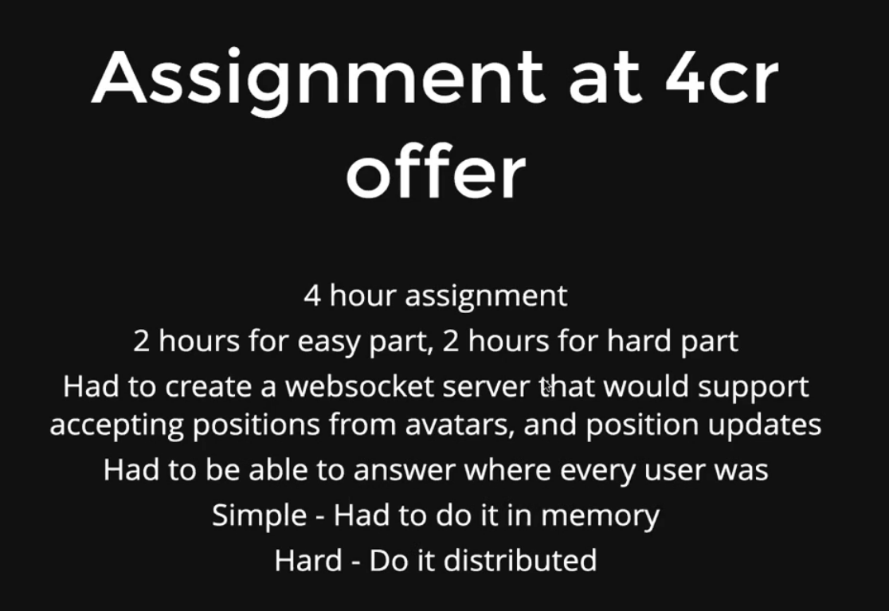
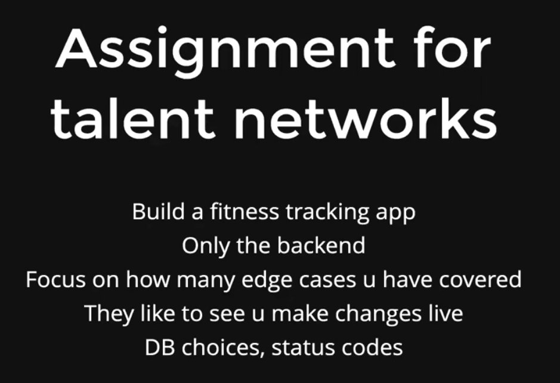
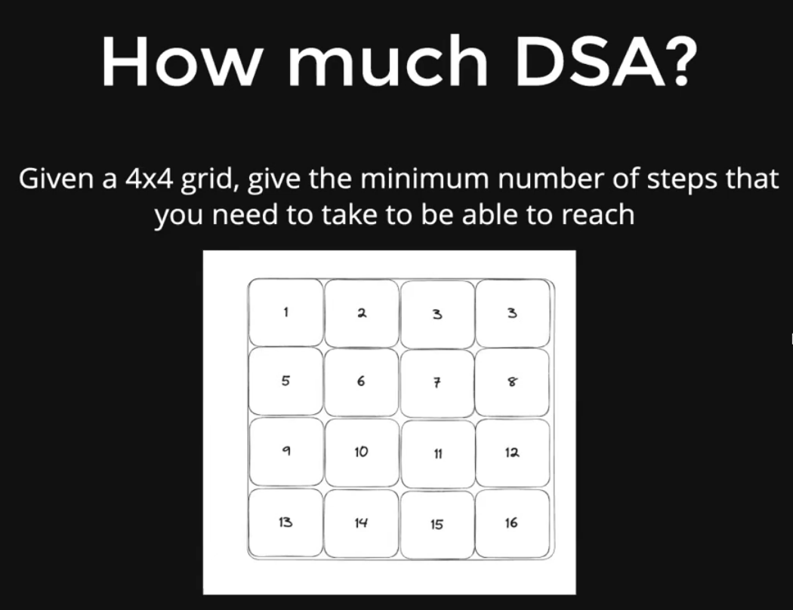

<h1 style="color:yellow">
Freelancing Masterclass 🧾
</h1>

## Table Of Contents

- [YC startups](#yc-startups)
- [How to apply](#how-to-apply)
- [Types of Companies (Summer 2023)](#types-of-companies-summer-2023)
- [Your Pitch](#your-pitch)
- [How much to ask?](#how-much-to-ask)
- [Interview Questions](#interview-questions)
- [Learn about talent network](#learn-about-talent-network)

**[⬆ Back to Top](#table-of-contents)**

## YC startups

- https://www.ycombinator.com/companies?batch=S23

## How to apply

- DM founder/HR on Linkedin
- Email them
  - make sure you provide value
  - Dont use the word 'sir' anywhere
  - Keep a solid github handy that's your resume
  - These are seed stage startups <$60k ideal to charge
  - If you're in college, $15-$20k is ideal to charge as an intern

## Types of Companies (Summer 2023)

- AI Companies (~50%)
- Some web3 companies (~10%)
- Full Stack companies (~25%)

**[⬆ Back to Top](#table-of-contents)**

## Your Pitch

- Hi, I'm a 20xx undergrad in CS, have worked at X in the past and am comfortable with the MERN Stack

Would love to get in touch in case your're hiring if my experience feels fit

You can find my projects here-
There's a list of contributions I've made to various companies-
I made a redesign of your website and deployed it here - vercel.x.com

**[⬆ Back to Top](#table-of-contents)**

## How much to ask?

- If this is your first offer

College - $10-$20k
0-2 years of exp - $40-$60k
2+ years of exp - $50-$75k

## Interview Questions

- Usually no DSA
- Past Projects
- Github
- College Projects

Within (AI/Web3) have you done something?

Did you get the time to research our product?

Background research -- How did you find us what makes this interesting for you?

**[⬆ Back to Top](#table-of-contents)**

## Learn about talent network

- a.com
- angola
- toptal

**[⬆ Back to Top](#table-of-contents)**
