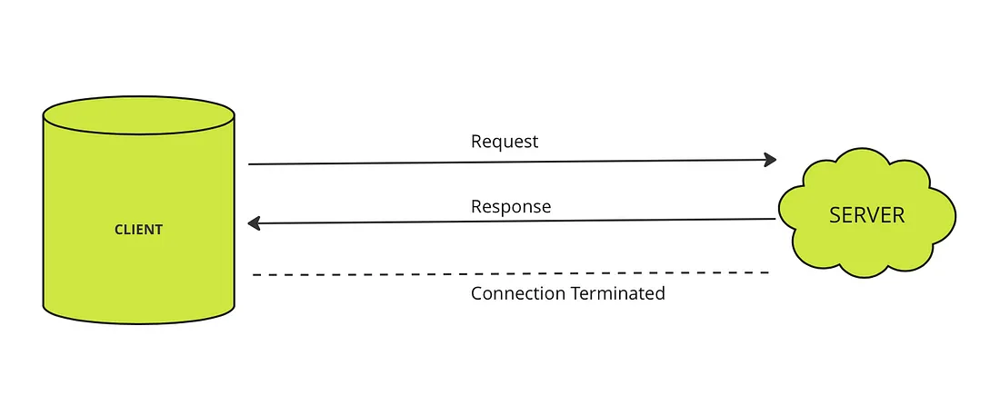
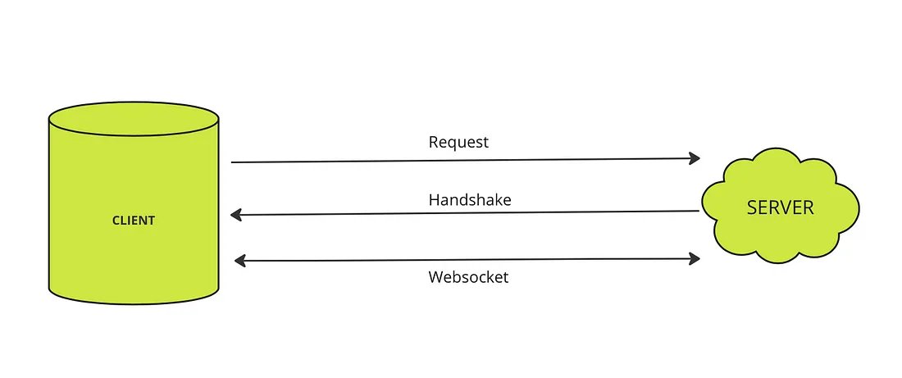
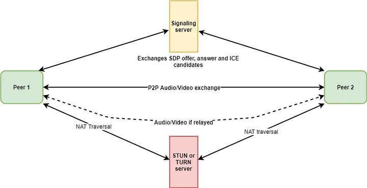

<h1 style="color:yellow">
WEBSOCKETS & WEBRTC  🧾
</h1>

## Table Of Contents

- [**WEBSOCKETS**](#websockets)
  - [How is WebSocket different from HTTP polling, HTTP streaming, and server-sent events?](#how-is-websocket-different-from-http-polling-http-streaming-and-server-sent-events)
  - [Why Websocket is being used?](#why-web-socket-is-being-used)
  - [How does Webscokets Work](#how-does-webscokets-work)
- [**WebRTC**](#webrtc)
  - [How does it work?](#how-does-it-work)
  - [localDescription & remoteDescription](#localdescription-remotedescription)
  - [WebRTC Vs WebSockets](#webrtc-vs-websockets)
  - [So if webRTC is so fast, why use websockets at all?](#so-if-webrtc-is-so-fast-why-use-websockets-at-all)
  - [Miscellaneous](#miscellaneous)

**[⬆ Back to Top](#table-of-contents)**

### **WEBSOCKETS**

> The WebSocket protocol offers persistent, real-time, full-duplex communication between the client and the server over a single TCP socket connection.

The WebSocket protocol has only two agendas: To open up a handshake and to help the data transfer. Once the server accepts the handshake request sent by the client and initiates a WebSocket connection, they can send data to each other with less overhead at will.

> WebSocket communication takes place over a single TCP socket using either WS (port 80) or WSS (port 443) protocol.

**NOTE:- For Docs or making a socket connetion in your appliation refer to this docs:- [Socket.io](https://socket.io/)**

#### How is WebSocket different from HTTP polling, HTTP streaming, and server-sent events?

Historically, creating web apps that needed real-time data (like gaming or chat apps) required an abuse of HTTP protocol to establish bidirectional data transfer. There were multiple methods used to achieve real-time capabilities, but none of them were as efficient as WebSocket. HTTP polling, HTTP streaming, Comet, and SSE  (server-sent events) all have their drawbacks.

1. **HTTP Polling:**

- The very first attempt to solve the problem was by polling the server at regular intervals.
- The normal polling approach fetches data from the server frequently based on an interval defined on the client side **(typically using setInterval or recursive setTimeout)**.
- On the other hand, the long polling approach is similar to normal polling, but the server handles the timeout/waiting time.

2. **HTTP streaming:**

- This mechanism saved the pain of network latency because the initial request is kept open indefinitely.
- When the response is sent back to the client, however, the request is never terminated; the server keeps the connection open and sends new updates whenever there’s a change.

3. **Server-sent events (SSE):**

- With SSE, the server pushes data to the client, similar to HTTP streaming. SSE is a standardized form of the HTTP streaming concept and comes with a built-in browser API.
- A chat or gaming application cannot completely rely on SSE. The perfect use case for SSE would be, for example, the Facebook News Feed: whenever new posts come in, the server pushes them to the timeline. SSE is sent over traditional HTTP and has restrictions on the number of open connections.

#### **WHY WEB-SOCKET IS BEING USED?**

> Let say you are working on an application, where you need to display data in real-time that is changing continuously. You first choice should be implementation of web sockets, There are other way as well, but that will increase the overhead on your servers and eventually you have to find some other reliable way to do it.

HTTP server Connection:

Websocket Connection:

#### **How does Webscokets Work**

1. _Handshake_: The client initiates a WebSocket connection by sending an HTTP request to the server, indicating a desire to upgrade the connection to WebSocket.

2. _Server Confirmation_: The server responds with an acknowledgment and a unique key, confirming the WebSocket upgrade.

3. _WebSocket Connection_: The connection transitions to the WebSocket protocol, allowing both client and server to send and receive data in real-time.

4. _Bidirectional Data Exchange:_ Data can now flow in both directions without the need for repeated HTTP requests, enabling real-time updates and interaction.

5. _Frames:_ Data is sent in small packets called frames. Various types of frames are used for different purposes, such as text or binary data.

6. _Closing:_ Either party can initiate a graceful connection closure by sending a close frame, allowing both to terminate the connection properly.

**FRAGMENTS:**

- When sending a message in WebSocket, it is common for the message to be split up into multiple frames, especially if the message is large or complex.
- This is where fragments come in. Fragments allow a message to be split up into smaller pieces, each of which is sent as a separate frame.

> **NOTE:-
> io - global socket object
> socket - indivindual socket object**

**[⬆ Back to Top](#table-of-contents)**

### **WebRTC**

> WebRTC stands for Web Real-Time Communications. WebRTC enables sending voice, video, and any arbitrary data across browsers in real-time in a peer-to-peer fashion.

- Unlike the usual client-server paradigm, peer-2-peer(P2P) is a technology where two clients can communicate directly with each other.

- The only standardized means for doing that across web browsers is by using WebRTC. P2P reduces the load on servers, reduces latency of messages, and increases privacy.

#### How does it work?

Imagine you want to connect to your friend on a video call that is using WebRTC, these are the high-level steps that would happen…

1. **The Offer**

- First, your browser would create an offer, this offer would result in the creation of an SDP (session description protocol) object which would contain information like video codec, timing, etc.

- This offer would then somehow be sent to your friend(the remote peer) asking them to connect with you using WebRTC.
- So, SDP is used by WebRTC to negotiate the session’s parameters.

2. **The Answer**

-Now your friend(the remote peer) has to answer the SDP offer that it received.

- To answer the call or the offer your friend has to create an SDP answer and somehow send that back to you.

3. **The Signaling server**

- The offer and answer data contains SDP objects that are used by WebRTC to negotiate the session’s parameters.

- Notice, how we talk about sending the offer to your friend and your friend sending the answer back to you, well there has to be some way to exchange this data. This is where a signaling server is useful.

- A signaling server can be any 3rd party server, it has the sole purpose of signaling which facilitates the exchange of messages between the 2 peers(you and your friend).

- Signaling servers often use WebSockets to exchange information between 2 peers like offer data, answer data, and ICE candidates.

> Thus, the signaling server(often implemented via WebSockets) allows 2 peers to securely exchange connection data in the form of SDP objects but never touches the data itself, that is actually transmitted between the peers themselves via WebRTC.

4. **STUN servers and TURN servers**

- In order to exchange media between two peers via WebRTC, they need to know each other’s IP addresses.

- However, in real world users/browsers/peers often sit behind firewalls and IP addresses constantly change due to NATs (Network address translation — Translates internal private IP addresses to external public IP addresses).

- This makes peer-to-peer connections complicated, to solve this we need to find the public-facing IP address of a peer this is where **STUN servers** are helpful.

**STUN (Session Traversal Utilities for NAT):**

- For the peers to know their public IP address for the purpose of successfully connecting to each other via WebRTC it sends a request to a STUN server asking for its public IP address.

- The server then replies back to the requester with its public IP address. This way, the WebRTC client learns what its public IP address is.

- The WebRTC client then shares its public IP address with the remote peer.

> In other words, you will first have to send a request to a STUN server that replies back to you with your public-facing IP address, you can then send this IP address to your friend(the remote peer). Your friend also must go through a similar process and send you their public-facing IP.

**TURN ( Traversal Using Relays around NAT):**

- Sometimes STUN servers might not always since with some network architecture and NAT device types, the public IP address obtained via STUN will not work in the case of symmetric NATs.

- This is why it is used in conjunction with TURN and ICE.

- TURN servers are useful to relay media when the use of STUN isn’t possible. The decision of whether to use STUN or TURN is orchestrated by a protocol called ICE.

- With a TURN server, we relay all the media through it, this can be expensive since it costs bandwidth and CPU on the server.

- This is why unlike STUN servers which are often publically available TURN servers aren’t usually available publically and need to install and maintained separately (or pay for a hosted service).

> Thus a STUN server is used to get an external network address and TURN servers are used to relay traffic if the direct (peer-to-peer) connection fails.

> Every TURN server supports STUN. A TURN server is a STUN server with additional built-in relaying functionality.

5. **ICE (Interactive Connectivity Establishment)**

- It is a standard method of NAT traversal used in WebRTC. ICE works to punch open ports in the firewalls

- ICE deals with the process of connecting media through NATs by conducting connectivity checks.

> Each address received from the STUN server is called ICE candidate (An ICE candidate contains a potential IP address and port pair that can be used to establish a peer-2-peer connection.)

Workflow Image: -

**[⬆ Back to Top](#table-of-contents)**

#### **localDescription & remoteDescription**

> In WebRTC (Web Real-Time Communication), localDescription and remoteDescription are key properties associated with the RTCPeerConnection object. They are used in the process of establishing and negotiating a WebRTC connection between two peers.

1. _localDescription_: This property represents the local description of the peer connection. It contains information about the local peer's media capabilities and preferences, such as the audio and video codecs it supports, its preferred encoding settings, and whether it wants to send or receive media streams. The localDescription is typically set after calling createOffer() or createAnswer() methods on the RTCPeerConnection. This local description is used to communicate the peer's preferences and capabilities to the remote peer during the offer-answer exchange.

2. _remoteDescription_: This property represents the remote peer's description of the connection. It contains information about the remote peer's media capabilities and preferences, as communicated during the offer-answer exchange. The remoteDescription is set after successfully applying a remote offer (using setRemoteDescription()) or a remote answer (using setRemoteDescription()). It tells the local peer what media streams to expect from the remote peer and how to handle them.

Here's a typical sequence of actions in a WebRTC connection that involve localDescription and remoteDescription:

1. Peer A creates an offer using createOffer(). The offer is stored in localDescription and sent to Peer B.

2. Peer B receives the offer, creates an answer using createAnswer(), and stores it in its localDescription. Peer B sends the answer back to Peer A.

3. Peer A receives the answer, applies it using setRemoteDescription(), and stores it in its remoteDescription.

4. Peer B receives the answer acknowledgment, applies it using setRemoteDescription(), and stores it in its remoteDescription.

**[⬆ Back to Top](#table-of-contents)**

### **WebRTC Vs WebSockets**

- With websockets we can also establish a connection between peers to exchange data in real time, but this connection is between the client and server. So if I send a message to a peer, the message first goes to the server, then the server sends that message to the other peer. This exchange typically happens really fast so even though there is some latency, you probably wouldn’t even notice it if you’re sending something like a chat message or some kind of notification.

- Now let’s say we wanted to exchange some audio or video using websockets, after all this is possible.

- The problem here is that even the slightest latency when it comes to audio and video can be very noticeable and causes a lot of issues. So by the time your video data hits the server and back to your peer, you’re gonna see a significant delay.

- This is where webRTC makes sense. By establishing a connection and exchanging data between two browsers we eliminate any delay that the server may add. WebRTC also uses **User Datagram Protocol, or UDP**, which is great for transmitting data really fast but more on that in a moment.

**[⬆ Back to Top](#table-of-contents)**

### **So if webRTC is so fast, why use websockets at all?**

- First, webRTC uses UDP, and UDP is not a reliable protocol for transferring important data. UDP is good at sending data really fast but it doesn’t check whether or not the data is being received. So UDP is great for video because the data gets there fast and if we lose a few frames it’s not a big deal; but if this were a file we needed to send over and we lose a few bytes of data the entire file can be corrupted.

> Websockets uses tcp so, if there is a chop in data due to bad internet it re asks for the data but in p2p connection in webRTC if it asks for the chop data then the video will again get delayed so for this it is better to leave out the chopped data and engage in the fresh data.

**[⬆ Back to Top](#table-of-contents)**

### **Miscellaneous**

> _SDP_ — A Session Description Protocol (SDP), is an object containing information about the session connection such as the codec, address, media type, audio and video and so on. Both peers will exchange SDP’s so they can understand how to connect to each other. One in the form of an SDP Offer and another as an SDP Answer.

> _Ice Candidates_ — An ICE candidate is a public IP address and port that could potentially be an address that receives data. Each user will typically have multiple Ice candidates that are gathered by making a series of requests to a STUN server.

> _tracks_ — In WebRTC (Web Real-Time Communication), "tracks" are a fundamental concept used to represent audio and video streams or data that can be transmitted over a WebRTC connection. Tracks are a way to encapsulate and manage different types of media that can be sent or received between peers.

> **[⬆ Back to Top](#table-of-contents)**
